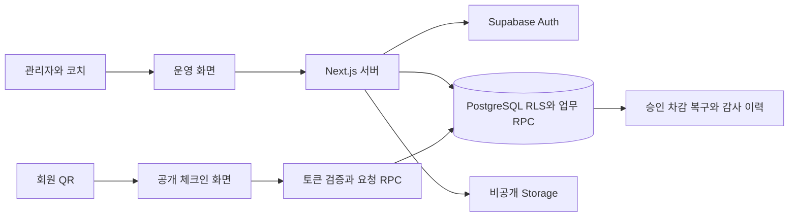

# JoPingPong — 탁구장 레슨 출석·횟수 관리

회원의 QR 출석 요청을 코치가 확인하고, **승인 → 레슨권 차감 → 기록 보존 → 취소 복구**를 연결하는 내부 업무 시스템입니다.

실제 운영에 사용한 프로젝트이며 기획·설계·개발·배포를 개인이 담당했습니다. 이 저장소는 **코드와 설계 경험을 소개하는 별도 공개본**입니다. 운영 데이터·환경변수·기존 Git 이력을 포함하지 않으며 운영으로 자동 배포되지 않습니다.

[운영 서비스](https://jopingpong.jopingpong.workers.dev/) · **관계자 계정 필요**

실제 운영 중인 서비스로, 회원 관리 화면은 관계자 계정으로 로그인해야 이용할 수 있습니다. 공개 체험 계정은 제공하지 않습니다.

## 문서

| 문서 | 내용 |
| --- | --- |
| [project-summary.md](docs/project-summary.md) | 프로젝트 개요·담당 역할·주요 경험 |
| [architecture.md](docs/architecture.md) | 시스템 구조·데이터 흐름·인증과 권한 |
| [database.md](docs/database.md) | 데이터 모델·제약조건·업무 규칙 |
| [troubleshooting.md](docs/troubleshooting.md) | 문제 해결 과정과 SQL·테스트 근거 |
| [security-review.md](docs/security-review.md) | 공개 범위·보안 보호 장치·검증과 제한사항 |

## 개발 배경

방문 사실과 실제 레슨 완료를 구분하고, 누가 어떤 회원의 레슨을 확인했는지와 어느 레슨권을 차감했는지를 함께 관리하고자 만들었습니다. QR은 승인 대기 요청만 생성합니다. 코치가 회원 정보와 잔여 횟수를 확인하고 승인하면 DB가 기록과 차감을 함께 처리합니다. 오승인은 삭제하지 않고 사유를 남긴 뒤 원래 레슨권을 복구합니다.

## 주요 기능

| 운영 문제 | 구현 |
| --- | --- |
| 요청과 실제 레슨 확인 구분 | QR·직접 요청, 선택 일괄 승인·거절 |
| 회원 정보와 등록권 관리 | 회원 등록·검색·사진·요일·메모, 8회권 관리 |
| 중복 승인과 잘못된 차감 방지 | DB 잠금·상태 재검사·하루 최대 2회 제약 |
| 추가 등록권 사용 순서 | 기존권 소진 후 다음 대기권 활성화 |
| 오승인·누락 기록 정정 | 관리자 취소·원래 권 복구, 과거 레슨 입력 |
| 당일 운영 확인 | 예정자·승인 대기·완료·잔여 부족·마감 경고 |
| 기록 활용 | 필터 조회·CSV, 승인 당시 잔여 스냅샷 |

QR 카드 저장·인쇄도 지원합니다. 카드 표시 영역에는 이름·전화번호가 들어갈 수 있으므로 시연에는 개발 데이터와 로컬에서 새로 발급한 QR만 사용합니다.

## 담당 역할과 기술

- 운영 요구사항과 회원·등록권·요청·승인·정정 흐름 설계
- 관리자·코치 화면과 QR 키오스크 구현
- Next.js 서버와 Supabase Auth·DB·Storage 연결
- PostgreSQL 모델·RLS·업무 RPC·감사 이력 구성
- 단위·DB 테스트와 검사·배포 파이프라인 구성

Codex·ChatGPT를 개발에 활용했습니다. 코드의 업무 규칙과 검증 범위는 설계 문서와 테스트로 확인할 수 있습니다. 운영 규모나 시간 절감 등 측정하지 않은 성과 수치는 기재하지 않습니다.

| 구분 | 기술 |
| --- | --- |
| 화면 | Next.js 16 App Router, React 19, TypeScript, CSS |
| 서버 | Server Components, Server Actions, Route Handlers, Zod |
| DB·인증·파일 | Supabase PostgreSQL, Auth, Storage, RLS, PL/pgSQL |
| QR | qrcode, @zxing/browser, Canvas |
| 배포 경험 | Cloudflare Workers, OpenNext, Wrangler |
| 검증 | ESLint, Vitest, Supabase CLI, pgTAP, GitHub Actions |

## 시스템 구조



일반 조회는 사용자 세션과 RLS를 사용합니다. 승인·차감·복구는 DB RPC에서 처리합니다. 회원 QR 요청은 로그인 대신 유효한 무작위 토큰이 필요합니다.

## 핵심 설계 경험

1. **중복 승인과 취소 복구:** 잠금과 상태 재검사로 재차감을 방어하고, 승인 기록의 `lesson_pass_id`로 원래 권을 복구합니다.
2. **하루 2회 규칙:** 첫 승인 후 두 번째 QR 요청은 허용하되 대기 중 중복 요청과 2회 이후 요청은 차단합니다.
3. **과거 기록 보존:** 승인 직후 총·사용·잔여를 저장해 현재 잔여와 당시 잔여를 구분합니다.
4. **QR·CSV 보호:** QR 링크 GET은 업무 데이터를 바꾸지 않습니다. 새 QR은 fragment 토큰을 사용하고 DB에서 유효 토큰별 1분 6회 제한을 적용합니다. CSV는 수식 주입과 캐시를 방어합니다.

[문제 해결 문서](docs/troubleshooting.md)에 SQL과 테스트 근거를 연결했습니다. 여러 DB 연결의 실제 동시성 시험은 별도 검증 대상입니다.

## 로컬 실행

Node.js 20.9 이상, npm, Docker Desktop이 필요합니다. CI는 Node.js 24를 사용합니다.

```powershell
npm ci
Copy-Item .env.example .env.local
npm run db:start
npm run db:reset
```

`db:reset`은 로컬 개발 DB를 초기화하고 샘플 데이터를 넣습니다. 운영 DB에 연결하거나 개발 seed를 운영에 적용하지 마세요. 시작 출력의 로컬 URL과 브라우저용 키를 `.env.local`에 설정합니다.

| 환경변수 | 로컬 설정 |
| --- | --- |
| NEXT_PUBLIC_SUPABASE_URL | 로컬 Supabase API URL |
| NEXT_PUBLIC_SUPABASE_PUBLISHABLE_KEY | 로컬 브라우저용 키 |
| SITE_URL | http://localhost:3000 |
| PENDING_WARNING_TIME_KST | 선택 항목, 한국 시간 HH:MM |

개발 계정은 `admin@example.com`, `coach@example.com`이며 로컬 전용 비밀번호는 `LocalDemoOnly123!`입니다. 샘플 회원은 번호 이름·전화번호 없음·임의 생년월일로 구성했습니다. 운영에 재사용하지 않습니다.

```powershell
npm run dev
```

`http://localhost:3000/login`에서 관리자 로그인 후 샘플 회원의 QR을 새로 발급하세요. QR 링크 요청 → 코치 승인 → 잔여 차감 → 관리자 취소 복구를 확인할 수 있습니다. 카메라 인식에는 HTTPS 또는 localhost와 카메라 권한이 필요합니다.

## 검증과 공개본 구성

```powershell
npm run check
# 로컬 Supabase와 Docker 실행 중일 때
npm run db:lint
npm run db:test
```

GitHub Actions는 PR·main push에서 앱 검사와 별도 로컬 DB 검사를 실행합니다. **공개본에는 배포 job과 운영 Secrets 연결이 없습니다.** Workers 설정은 로컬 주소를 사용하며 실제 배포하려면 본인의 별도 환경을 구성해야 합니다.

## 남은 개선사항

- 기록·CSV의 현재 1,000행 제한을 페이지 조회로 보완
- 등록·조정·승인·취소의 잠금 순서와 다중 연결 동시성 검증
- 계정 폐기·최소 권한·전체 요청량 제한·백업 복구 절차 점검

[초기 개발 명세](탁구장_레슨_출석관리_개발명세서_v1.md)는 초기 계획입니다. 현재 동작은 코드와 후속 migration을 기준으로 설명합니다.

