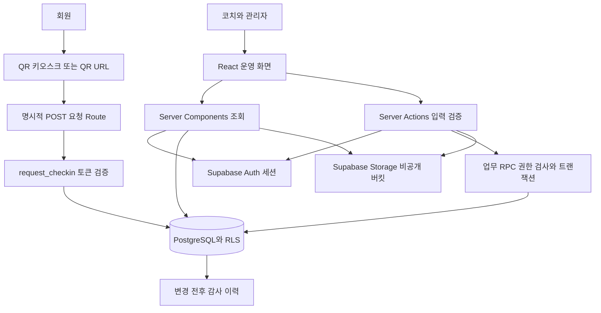
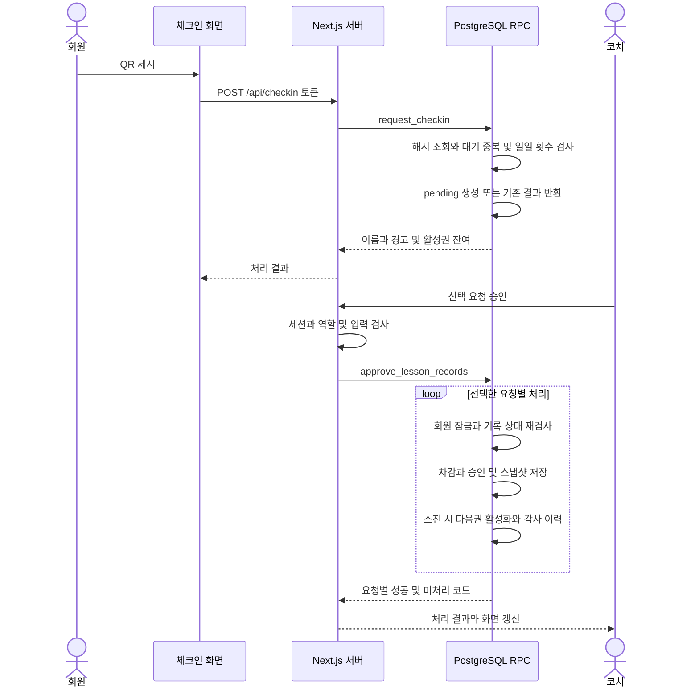
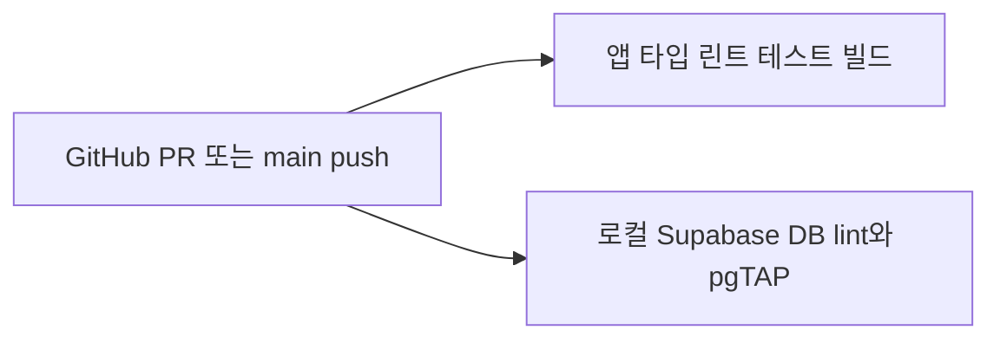

# 시스템 구조

## 전체 구조

Next.js가 Frontend와 서버 처리를 함께 담당합니다. Supabase는 인증·관계형 DB·파일 보관을 제공합니다. 서버에도 service role 키를 사용하는 코드가 없으며 사용자 세션과 publishable key를 사용합니다.

## 주요 컴포넌트

| 위치 | 역할 |
| --- | --- |
| `src/app/dashboard/page.tsx` | 오늘 예정자·승인 대기·완료·주의 대상 조회·분류 |
| `src/app/approvals`, `approval-workspace.tsx` | 승인 대기·처리 결과와 선택 승인·거절 |
| `src/app/members` | 회원 정보, 사진, QR 발급·재발급 |
| `src/app/lesson-passes` | 8회권 등록·잔여 조정·수동 만료 |
| `src/app/lesson-records` | 기록 필터·승인 취소·과거 입력·CSV |
| `qr-checkin-kiosk.tsx` | ZXing 카메라 인식, 결과 표시·5초 후 초기화 |
| `qr-preview.tsx` | 인증된 QR 표시, Canvas 가로·세로 카드 저장·인쇄 |
| `src/lib/auth`, `middleware.ts` | 세션 확인·로그인 이동·역할 검사 |
| `src/lib/date`, `operations/pending-warning.ts` | 한국 영업일·요일·마감 경고 |
| `supabase/migrations` | 상태·제약·RLS·Storage 정책·업무 함수·감사 트리거 |

`DashboardRefresh`는 10초마다 `router.refresh()`를 호출합니다. Realtime 구독·푸시 알림은 없습니다. 예정자는 고정 요일 기준이며 예약·대기 순서 계산이 아닙니다.

## 요청과 승인 데이터 흐름

`/checkin`의 GET은 DB 요청을 만들지 않습니다. 브라우저는 기존 query 또는 새 fragment에서 토큰을 읽고 URL을 정리한 뒤 확인 버튼을 표시합니다. 버튼 클릭과 키오스크의 실제 QR 스캔만 POST 요청을 보냅니다. 유효 토큰별 1분 6회 제한은 DB 함수에 있어 직접 Supabase RPC 호출에도 적용됩니다. 무효 토큰의 전체 요청량은 운영 WAF 등으로 별도 제한해야 합니다.

일괄 승인은 선택 건별 결과를 돌려주고 내부 예외를 해당 건의 `error`로 처리합니다. 모든 선택 건이 반드시 성공하는 방식은 아닙니다. 화면 갱신은 `revalidatePath`와 주기적 재조회입니다.

## 인증과 권한

| 주체 | 허용 범위 |
| --- | --- |
| 비로그인 회원 | 체크인 화면, 유효 토큰 기반 요청·결과 확인 |
| `coach` | 운영 데이터·QR 조회, 직접 요청, 승인·거절, 기록 CSV |
| `admin` | 코치 기능 + 회원·QR·권 관리, 승인 취소, 과거 입력 |

1. Middleware는 `/checkin`, `/api/checkin`을 세션 검사 없이 통과시키고 다른 경로의 로그인 상태를 확인합니다.
2. `requireProfile`은 JWT claims·프로필·허용 역할을 확인합니다.
3. RLS는 업무 데이터 조회·변경을 역할로 제한합니다. 업무 RPC는 `SECURITY DEFINER`이므로 내부에서도 역할을 검사합니다.

`is_active_staff`라는 이름은 남아 있지만 최신 migration에서 `is_active` 조건을 제거했습니다. `profiles.is_active = false`만으로 계정을 차단할 수 없습니다. 회원가입 차단·계정 폐기 등 운영 Auth 설정은 별도 확인 대상입니다.

`profiles` 조회는 본인 또는 관리자에게 허용됩니다. 코치가 다른 담당자의 이름을 조회하면 RLS로 제외되어 UUID·알 수 없음 등으로 표시될 수 있습니다. 역할별 화면 검증이 필요합니다.

## 외부 서비스·파일

- **Auth:** 이메일·비밀번호 로그인과 쿠키 세션. 계정은 Supabase에서 수동 생성하며 `/accounts`는 없습니다.
- **DB:** SDK로 테이블 조회·RPC 호출. 공개 요청 함수 외에는 익명 업무 데이터 조회 정책이 없습니다.
- **Storage:** `member-private`에 사진·QR SVG 저장. 사진은 600초 signed URL, QR은 인증된 `/api/members/[id]/qr`로 전달합니다.
- **QR:** 서버가 32바이트 무작위 토큰을 만들고 DB에는 SHA-256 해시를 저장합니다. 새 QR은 검증된 `SITE_URL` 기준의 `/checkin#t=...`이며 fragment는 HTTP URL에 전송되지 않습니다. 기존 query QR도 인식하지만 해당 URL의 과거 로그는 별도 점검 대상입니다. 원본 토큰을 표현하는 SVG는 접근 자격정보로 취급해야 합니다.

QR 인코딩에는 이름·전화가 없지만 인쇄 카드 표시에는 포함됩니다. 결제·문자·AI API 연동은 없습니다.

## 공개본 검사와 배포 경험

[CI workflow](../.github/workflows/ci.yml)는 앱·DB 검사만 수행합니다. 운영 자동 배포와 Secrets 연결은 공개본에서 제거했습니다. 실제 프로젝트에서는 OpenNext와 Cloudflare Workers를 사용했습니다. 공개본의 [OpenNext 설정](../open-next.config.ts)과 [Wrangler 설정](../wrangler.jsonc)은 별도 환경 구성에 참고할 수 있습니다.

세션 갱신은 Edge `middleware.ts`를 사용합니다. 초기 README는 OpenNext의 Proxy 호환을 선택 이유로 설명했습니다. 현재 어댑터 지원 상태를 검증한 것은 아니므로 구현 사실과 당시 선택 근거를 구분합니다.

## 운영 준비·복구

1. 운영 Supabase 프로젝트에서 signup 차단·역할·Storage 비공개·migration 적용 상태를 확인합니다. 로컬 `config.toml`만으로 운영 설정이 보장되지 않습니다.
2. CLI 연결 후 `npx supabase db push --dry-run`으로 변경을 검토하고 적용합니다. 운영 DB에서 `db reset`을 사용하지 않으며 seed도 넣지 않습니다.
3. 운영 계정을 Auth에서 생성하고 첫 관리자 역할을 지정합니다. 별도 배포 환경을 구성한다면 그 환경에 배포·Supabase 변수를 설정합니다.
4. `SITE_URL`을 실제 HTTPS 주소로 설정하고 새 migration을 검토·적용합니다. 가명 데이터로 링크 접속만으로 요청이 생기지 않는지, 요청 버튼·카메라 QR → 승인 → 권 소진·다음권 → 취소 복구 → CSV를 점검합니다.
5. migration 전 DB 백업 상태를 확인합니다. 별도 논리 백업은 역할·스키마·데이터를 나누고 연결 문자열·dump를 저장소에 올리지 않습니다.
6. Storage 사진·QR은 DB dump에 포함되지 않으므로 별도로 백업합니다. 새 점검 환경에서 역할·스키마·데이터·파일을 복구하고 회원 수·권 잔여·승인 기록을 대조합니다.
7. 장애 중 누락된 레슨은 관리자 과거 등록으로 실제 날짜·담당자를 남깁니다. 현재 활성권을 차감하므로 당시 사용권과 맞는지는 운영자가 검토합니다.

공개본의 검사 결과는 이 저장소의 GitHub Actions에서 확인합니다. 로컬 테스트 DB 검증과 운영 환경 검증은 구분합니다.

