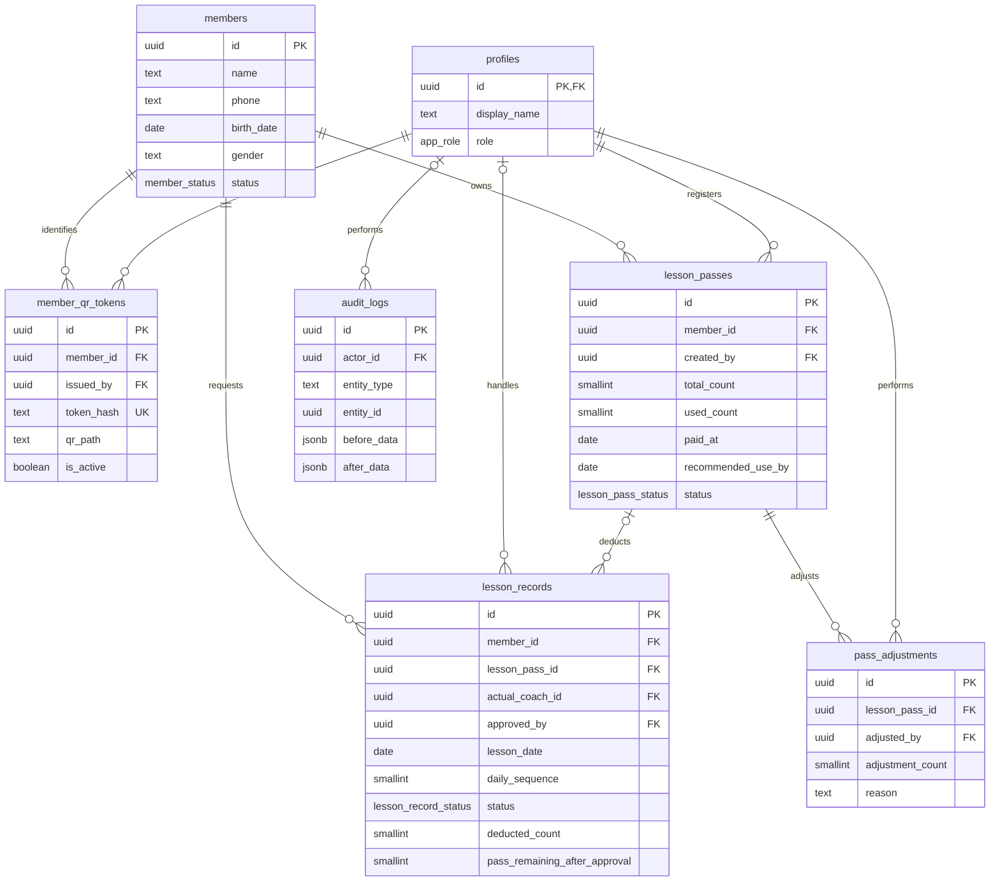
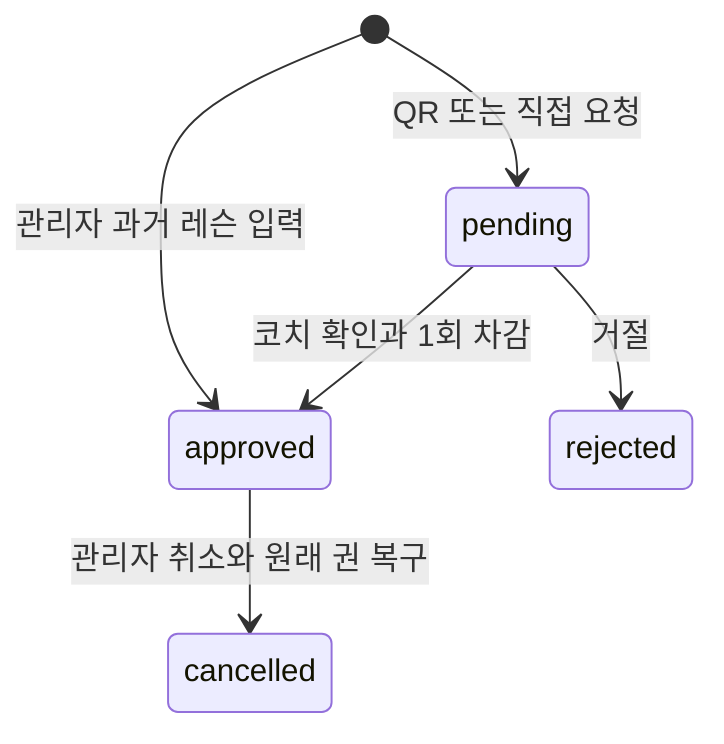

# 데이터 모델과 운영 규칙

## 모델링 개요

회원·운영 계정·개별 레슨권·요청 및 처리 기록을 분리했습니다. 권에는 현재 사용 횟수를 두고 승인 기록에는 원래 차감한 권과 승인 직후 횟수를 남깁니다. 현재 상태 조회와 과거 처리 설명의 기준을 분리한 구조입니다.

주요 컬럼만 표시했습니다. `profiles.id`는 `auth.users.id`를 참조합니다. 기록의 거절·취소 담당자도 `profiles` FK입니다. `audit_logs.entity_id`는 테이블을 가로지르는 논리 참조이며 FK가 아닙니다.

## 주요 테이블

| 테이블 | 데이터와 역할 |
| --- | --- |
| `profiles` | 로그인하는 관리자·코치, 처리 담당자 |
| `members` | 이름·전화·생년월일·성별·부수·고정 요일·사진 경로·메모·상태 |
| `member_qr_tokens` | 해시·발급자·유효 상태·실효 이유·SVG 경로, 요청 창 시작 시각·횟수. 재발급 시 이전 QR 무효화 |
| `lesson_passes` | 8회권별 등록일·사용수·권장 소진일·상태. 잔여는 `total_count - used_count` |
| `lesson_records` | 요청·승인·거절·취소, 실제 일자·담당자·원래 차감권·승인 시점 스냅샷 |
| `pass_adjustments` | 잔여 수동 조정의 차이·사유·담당자 |
| `audit_logs` | 회원·QR·권·기록 INSERT/UPDATE 전후 JSON과 수행자·사유 |

## ID·날짜 설계

- 업무 PK는 `gen_random_uuid()`이며 프로필은 Auth UUID를 공유합니다. 동명이인도 회원 ID로 구분합니다.
- QR은 회원 ID와 별도로 발급한 32바이트 난수의 base64url입니다. DB에는 SHA-256 해시를 둡니다.
- `lesson_date`는 실제 업무일, `requested_at`·`approved_at`은 처리 시각입니다. 과거 입력은 실제 레슨일과 입력 시각을 분리합니다.
- `business_date()`와 화면 `koreaBusinessDate()`는 `Asia/Seoul` 기준입니다. 일부 수동권 처리·회원 날짜 검증에는 `current_date`도 남아 있어 날짜 경계 점검이 필요합니다.

## 상태값 관리

| 대상 | 현재 상태·운용 |
| --- | --- |
| 회원 | `active`·`ended`. enum의 `paused`는 남지만 CHECK로 금지, 휴회 컬럼 삭제 |
| 권 | `pending`·`active`·`exhausted`·`expired`·`cancelled`. `cancelled` 값은 있지만 권 취소 전용 UI/RPC는 확인되지 않음 |
| 기록 | `pending` → `approved` 또는 `rejected`, `approved` → `cancelled` |
| 요청 방식 | `qr`·`coach_manual`·`outage_recovery` |
| QR | `is_active`와 실효 일시·사유 |
| 역할 | `admin`·`coach`. 최신 권한 함수는 `profiles.is_active`를 검사하지 않음 |

## 주요 데이터 흐름

1. **권 등록:** 소진된 활성권을 정리하고 필요하면 가장 오래된 대기권을 활성화합니다. 사용권이 있으면 새 권은 `pending`, 없으면 `active`로 등록합니다.
2. **요청:** QR 해시 확인·토큰 행 잠금 → 유효 토큰별 1분 6회 검사 → 회원 잠금 → 기존 대기·당일 승인 2건 검사 → 요청 생성. 레슨 횟수는 차감하지 않습니다. 제한 응답은 회원정보 없이 반환합니다.
3. **승인:** 대기 상태·사용권 재검사 → 일일 슬롯 1 또는 2 할당 → 사용수 증가·승인·스냅샷 저장 → 소진 시 다음 권 활성화.
4. **취소:** 기록의 원래 `lesson_pass_id`에 1회 복구합니다. 다음 권이 미사용이면 대기로 되돌리고, 이미 사용 중이면 원래 권을 대기로 복구해 활성권 중복을 피합니다.
5. **과거 입력:** 관리자가 실제 날짜·담당자를 지정합니다. 현재 활성권을 차감하며 당시 사용권을 자동 선택하지 않습니다.
6. **수동 조정:** 잔여 0~8회와 사유 검사 → 사용수 변경 → 조정 차이·감사 이력 저장.

## 정합성 유지 방식

- **부분 UNIQUE:** 회원별 유효 QR 1개·활성권 1개·대기 기록 1개, 승인 `(member_id, lesson_date, daily_sequence)` 유일성.
- **CHECK:** 총 8회·사용 0~8회·일일 슬롯 1/2, 승인 필수 담당자·시각·차감 1회, 취소 사유·차감 0회.
- **RPC·잠금:** 승인·취소·과거 입력의 advisory lock·행 잠금·상태 재검사로 반복 처리를 방어합니다.
- **공개 요청 제한:** QR 토큰의 `request_window_started_at`·`request_count`를 행 잠금 아래 갱신해 여러 서버·직접 RPC 호출에서도 같은 유효 토큰의 제한을 공유합니다. 미등록 토큰의 전체 트래픽 제한은 별도 운영 설정입니다.
- **회원 식별:** 전화 형식과 변경 시 전화·이름＋생년월일 중복을 트리거·잠금으로 검사합니다. 기존 더미 중복을 보존하므로 전화 전체에 UNIQUE 제약이 적용된 구조는 아닙니다.
- **감사:** 트리거가 변경 전후 JSON을 저장하고 RPC는 `app.audit_reason`을 설정합니다. 수동 조정은 별도 차이 기록도 남깁니다.
- **권한:** 테이블 RLS와 RPC 내부 역할 검사, 비공개 Storage 정책을 사용합니다.

`recommended_use_by`는 등록일＋2개월－1일인 생성 컬럼이며 자동 실효일이 아닙니다. 경고와 강제 상태 변경을 분리했습니다.

## 중요한 설계 판단과 남은 점검

현재 수치와 승인 당시 스냅샷을 함께 저장해 운영 조회와 과거 설명을 구분했습니다. 원래 차감권을 FK로 남겨 취소를 현재 사용권의 상태와 분리했습니다. 상태·이력을 남기는 방식은 추적에 유리하지만 개인정보 보관기간도 함께 정해야 합니다.

- 권 등록·조정·만료는 잠금용 seed `0`, 요청·승인·취소·과거 입력은 seed `1`을 씁니다. 전 경로가 동일 회원 잠금으로 직렬화된다고 단정할 수 없습니다. 잠금 순서·다중 연결 시험이 필요합니다.
- 관리자에게 권의 직접 INSERT/UPDATE 권한도 있어 RPC의 수정 사유·차이 이력을 항상 강제하지는 않습니다. 직접 변경에도 감사 트리거는 동작하지만 이유가 비어 있을 수 있습니다.
- 기존 승인 스냅샷 보완은 현재 값·승인 순서 역산입니다. 과거 수동 조정·취소까지 정확히 재현했다는 근거는 없습니다.
- 회원·권·기록 간 개별 FK는 있지만 동일 회원의 권이라는 조건을 복합 FK로 강제하지는 않습니다.
- 기록·CSV 최대 1,000행, 최근 기록 일부 500행으로 전체 기간 집계·전건 내보내기라고 표현할 수 없습니다.
- `audit_logs` JSON에 개인정보가 남으며 회원 종료만으로 지워지지 않습니다.

## 개발 DB와 검증

[로컬 설정](../supabase/config.toml)은 PostgreSQL 17·API 상한 1,000행·signup 비활성화를 지정합니다. `db:reset`은 로컬 migration과 seed를 적용합니다. 운영에 같은 설정이 적용되었는지는 별도 확인해야 합니다.

`supabase/tests/database`의 pgTAP은 RLS·요청·승인·취소·권 수정·과거 입력 테스트입니다. Vitest의 SQL 문자열 검사는 DB 실행 시험과 다릅니다. 운영 migration 적용 이력과 DB 시험 결과를 남기는 것이 다음 검증 과제입니다.

